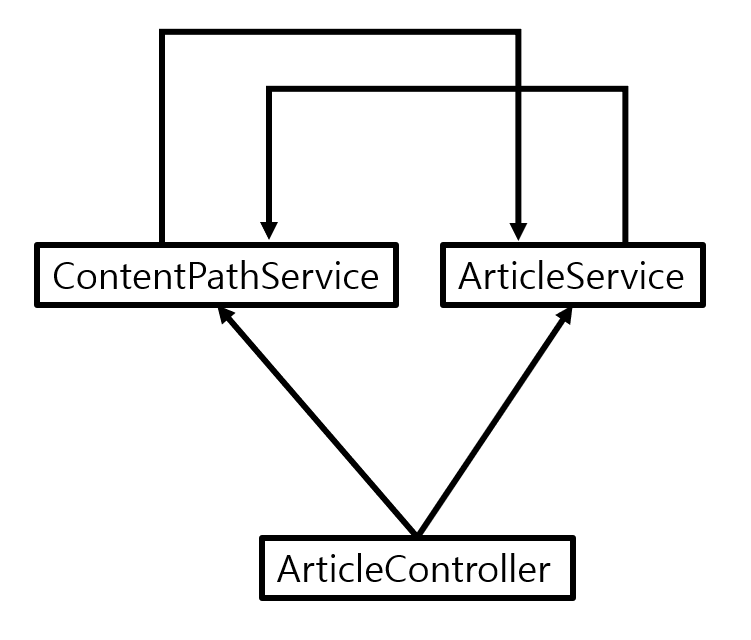

= 트러블 슈팅 리스트

== 1. Websocket 연결 실패 : TimeoutException
테스트 코드로 Spring STOMP 연결을 시도하여 메시지 송수신 테스트 중, client가 메시지를 수신받지 못하고 `completableFuture.get(5, TimeUnit.SECONDS);` 에서 `TimeoutException`이 발생함.

[source, java]
----
@ExtendWith(SpringExtension.class)
@SpringBootTest(webEnvironment = SpringBootTest.WebEnvironment.RANDOM_PORT)
@AutoConfigureMockMvc
public class WebSocketIntegrationTest {

    @LocalServerPort
    private int port;

    @Autowired
    private MockMvc mockMvc;

    private String url;

    private CompletableFuture<Notification> completableFuture;
    private WebSocketStompClient stompClient;

    private static Notification notification;
    private static User user;
    private static Article article;

    @BeforeEach
    public void setUp() {
        this.stompClient = new WebSocketStompClient(
            new SockJsClient(
                List.of(new WebSocketTransport(new StandardWebSocketClient()))
            )
        );
        this.stompClient.setMessageConverter(new MappingJackson2MessageConverter());
        this.completableFuture = new CompletableFuture<>();
        this.url = "ws://localhost:" + port + "/ws";
    }

    @Test
    @Transactional
    public void likeArticle_shouldSendNotification() throws Exception {
        StompSession session = stompClient
            .connect(url, new StompSessionHandlerAdapter() {})
            .get(5, TimeUnit.SECONDS);

        session.subscribe("/user/testId/queue/notification", new StompFrameHandler() {
            @Override
            public Type getPayloadType(StompHeaders headers) {
                return new TypeReference<Notification>() {}.getType();
            }

            @Override
            public void handleFrame(StompHeaders headers, Object payload) {
                completableFuture.complete((Notification) payload);
            }
        });

        mockMvc.perform(put("/articles/{articleId}/like", 1L))
            .andExpect(status().isOk());

        Notification notification = completableFuture.get(5, TimeUnit.SECONDS);
    }
}
----

=== 원인 분석
- `completableFuture.get()` 의 대기 시간이 너무 짧아서 발생해서 발생한 것인지 확인 필요

- 연결 자체가 안된 것인지, 연결은 되었지만 메시지가 전달되지 않은 것인지 확인 필요

- 송수신 상 엔드포인트가 잘못된 것은 아닌지 확인 필요

- WebSocketConfiguration 클래스의 설정 재확인

=== 해결 방법
우선 Log를 DEBUG로 설정 해놓은 뒤 코드가 어디까지 정상 작동했는지 확인이 필요했다.

로그를 확인해보니, 직접 작성한 로직에 찍은 log들은 제대로 읽혔다. 그렇다면 websocket 프레임워크 상에서 동작을 안한 부분이 있다는 의미가 된다.
콘솔에 출력된 로그에는 client가 server와 연결되어 sessionId를 생성했다는 로그가 출력 됐지만 소스 코드 상 client는 server의 엔드포인트에 구독을 했다는 로그가 출력되지 않았다. client와 connet할 때 handler의 afterConnected() 메서드의 로그는 출력이 됐지만, server에서 생성한 메시지를 client에 전송할 때 사용되는 getPayloadType()과 handleFrame() 메서드의 로그는 출력되지 않았다. 이는 client가 server에게 메시지를 전송하지 않았다는 것을 의미한다.

-> 이는 엔드포인트가 잘못됐다는 가능성을 암시한다.

코드를 고치기 전 작성한 로직은 `"/user/testId/queue/notification"` 이었으나, 이는 잘못되었다. 프레임워크는 로그인아이디에 해당하는 부분을 URI를 자동으로 설정하기 때문이다. 즉, `/user/testId/~` 로 구독을 했다면 프레임워크는 이 URI를 `/user/testId/testId/~` 로 변경하여 구독을 시도한다. 적절하게 설정된 URI는 `/user/queue/notification` 이다.

-> [nboundChannel-6] o.s.m.s.b.SimpleBrokerMessageHandler     : Processing SUBSCRIBE destination=/queue/notification-user3ea84715c91d46db8b4b974a8b92c821 subscriptionId=0 session=3ea84715c91d46db8b4b974a8b92c821 payload=byte[0]

구독이 되지 않는 문제는 해결되었으나 메시지를 클라이언트가 수신받지 못하는 문제는 해결되지 않았다.

- CompletableFuture의 대기시간을 길게 늘렸으나, 여전히 메시지를 수신받지 못함
- URI를 적절하게 수정하였으나 구독은 정상적이지만 서버에서 송신을 하지 못함.
- WebSocketConfiguration 클래스의 설정을 재확인하였으나 문제가 없음.
- 직접 작성한 Service 로직의 로그들은 정상적으로 콘솔에 출력됨.

GPT나 Claude를 사용하여 코드를 작성할 때 가장 주의해야 하는 점은 프레임워크에 대한 개념이 부족한 경우 AI가 작성한 코드를 제대로 이해하지 못하면 디버깅할 때 큰 시간을 소모하게 된다는 점이다.

내 경우에 이 에러의 근본적인 원인은 JWT를 이용하여 로그인을 구현하였지만 Client가 송신하는 http의 header에 인증토큰을 제공하지 않아 메시지가 송수신되지 않았다는 점이었다.

=== 원인 해결
1. 잘못된 URI 수정 : `/user/testId/queue/notification` -> `/user/queue/notification`

2. 클라이언트가 송수신하는 http의 header에 JWT로 생성한 인증토큰을 제공하도록 수정

== 2. 두 클래스 간 상호참조 에러 : dependency cycle

```TEXT
7.The dependencies of some of the beans in the application context form a cycle:

   articleController defined in file [C:\dev\java-project\blog-project\build\classes\java\main\com\example\personal_blog\controller\ArticleController.class]
┌─────┐
|  articleService defined in file [C:\dev\java-project\blog-project\build\classes\java\main\com\example\personal_blog\service\ArticleService.class]
↑     ↓
|  contentPathService defined in file [C:\dev\java-project\blog-project\build\classes\java\main\com\example\personal_blog\service\ContentPathService.class]
└─────┘
```

=== 원인 분석
- 게시글을 작성하여 저장할 때 게시글의 내용은 `ArticleService` 를 통해 처리되지만, 이미지의 경우 `ContentPathService` 를 통해 처리된다.



기존의 구조에서 `Controller` 에서 두 서비스를 동시에 호출하는 형식으로 코드를 작성했었다. 하지만 `ArticeService` 는 게시글이 수정될 때 이미지 저장도 같이 호출해야 하므로 `ArticleService` 내에서 `ContentPathService` 를 호출하는 로직이 있었고 이 때문에 cycle이 생긴 것이다.

=== 해결

image::../docResource/new.png[]

컨트롤러 계층에서 두 서비스에 의존하던 것을 수정하여 `ArticleService` 에서 `ContentPathService` 를 호출하는 방식으로 변경하였다.